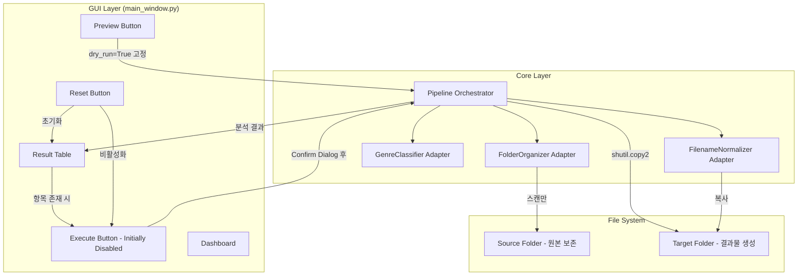
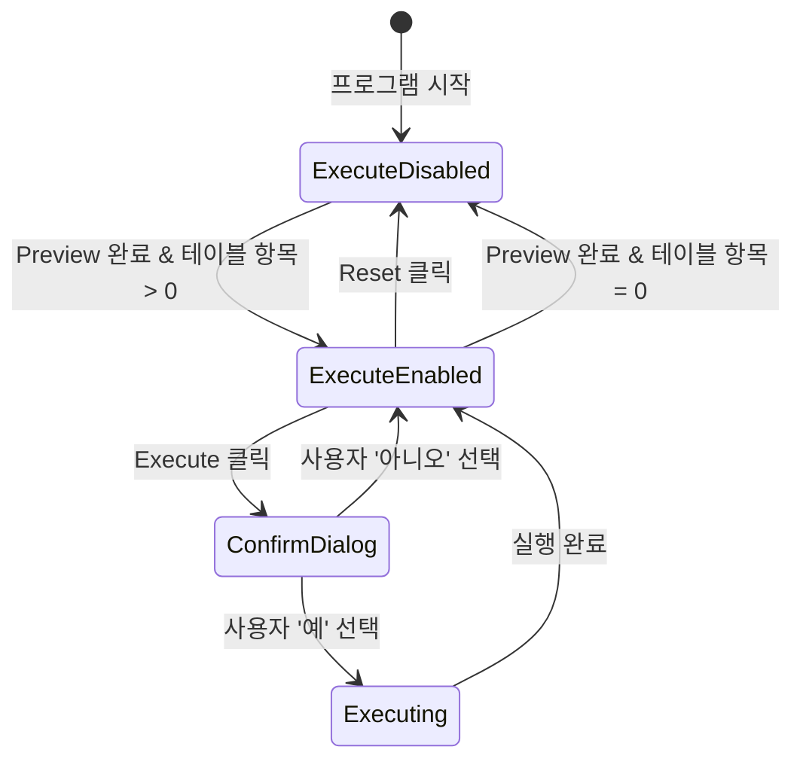

# Design Document: GUI Execution Safety

## Overview

WNAP GUI의 실행 로직과 UX를 전면 개편하여 안전성과 사용성을 향상시킵니다. 핵심 변경사항은 미리보기/실행 로직의 완전 분리, 복사 기반 원본 보존 로직 도입, 안전한 실행 시퀀스 구현입니다.

## Architecture



## Components and Interfaces

### 1. GUI Layer (gui/main_window.py)

#### 버튼 상태 관리

```python
class WNAPMainWindow:
    def __init__(self):
        # Execute 버튼 초기 상태: 비활성화
        self.run_btn.configure(state="disabled")
    
    def _run_preview(self):
        """미리보기 실행 - 항상 dry_run=True"""
        # Dry-run 스위치 상태와 무관하게 항상 분석만 수행
        self._execute_pipeline(dry_run=True)
    
    def _run_execute(self):
        """실행 버튼 - 확인 대화상자 후 실제 복사"""
        count = len(self.result_tree.get_children())
        if count == 0:
            return
        
        # 확인 대화상자
        if not messagebox.askyesno(
            "실행 확인",
            f"{count}개의 파일을 실제로 변환하시겠습니까?\n\n"
            f"원본 파일은 보존되며, 결과물은 타겟 폴더에 복사됩니다."
        ):
            return
        
        self._execute_pipeline(dry_run=False)
    
    def _update_execute_button_state(self):
        """Result Table 항목 수에 따라 Execute 버튼 상태 업데이트"""
        count = len(self.result_tree.get_children())
        if count > 0:
            self.run_btn.configure(state="normal")
        else:
            self.run_btn.configure(state="disabled")
    
    def _clear_all(self):
        """초기화 - Execute 버튼도 비활성화"""
        # 기존 초기화 로직...
        self.run_btn.configure(state="disabled")
```

### 2. Pipeline Orchestrator (core/pipeline_orchestrator.py)

#### 복사 기반 파일 처리

```python
class PipelineOrchestrator:
    def _copy_file(self, task: NovelTask):
        """파일 복사 (원본 보존)"""
        target_path = Path(task.metadata['target_path'])
        source_path = task.current_path
        
        # 타겟 디렉토리 생성
        target_path.parent.mkdir(parents=True, exist_ok=True)
        
        # shutil.copy2로 메타데이터 보존 복사
        shutil.copy2(str(source_path), str(target_path))
        
        # current_path는 원본 유지 (원본 보존)
        task.metadata['copied_to'] = str(target_path)
    
    def _count_source_files(self, source_folder: Path) -> int:
        """소스 폴더 파일 개수 카운트"""
        count = 0
        for item in source_folder.rglob('*'):
            if item.is_file():
                count += 1
        return count
    
    def run(self, source_folder: Path, dry_run: bool = False) -> PipelineResult:
        # 실행 전 파일 개수 기록
        pre_count = self._count_source_files(source_folder)
        
        # ... 기존 로직 ...
        
        # 실행 후 파일 개수 확인 (dry_run이 아닐 때만)
        if not dry_run:
            post_count = self._count_source_files(source_folder)
            result.source_preserved = (pre_count == post_count)
            result.pre_file_count = pre_count
            result.post_file_count = post_count
            
            if not result.source_preserved:
                self.logger.warning(
                    f"원본 파일 개수 변경 감지: {pre_count} → {post_count}"
                )
        
        return result
```

### 3. PipelineResult 확장

```python
@dataclass
class PipelineResult:
    total_files: int = 0
    processed: int = 0
    failed: int = 0
    skipped: int = 0
    tasks: List[NovelTask] = field(default_factory=list)
    mapping_csv_path: Optional[Path] = None
    errors: List[str] = field(default_factory=list)
    
    # 원본 보존 검증 필드 추가
    source_preserved: bool = True
    pre_file_count: int = 0
    post_file_count: int = 0
```

## Data Models

### 버튼 상태 전이



### 파일 처리 흐름

| 단계 | 동작 | 원본 파일 | 타겟 파일 |
|------|------|----------|----------|
| Preview | 분석만 | 변경 없음 | 생성 안함 |
| Execute | 복사 | 보존 | 생성 |

## Correctness Properties

*A property is a characteristic or behavior that should hold true across all valid executions of a system—essentially, a formal statement about what the system should do. Properties serve as the bridge between human-readable specifications and machine-verifiable correctness guarantees.*

### Property 1: Preview는 파일 시스템을 변경하지 않음

*For any* 소스 폴더와 Dry_Run_Mode 스위치 상태에 대해, Preview_Button 클릭 시 소스 폴더와 타겟 폴더의 파일 시스템 상태는 실행 전과 동일해야 한다.

**Validates: Requirements 1.1, 1.2, 3.1**

### Property 2: Execute는 원본을 보존하며 복사만 수행

*For any* 소스 폴더의 파일에 대해, Execute_Button 실행 후 소스 폴더의 파일 개수와 내용은 실행 전과 동일해야 하며, 결과물은 타겟 폴더에만 생성되어야 한다.

**Validates: Requirements 4.1, 4.2, 4.3, 4.4**

### Property 3: Execute 버튼 활성화 조건

*For any* GUI 상태에 대해, Execute_Button은 Result_Table에 1개 이상의 항목이 존재할 때만 활성화되어야 한다.

**Validates: Requirements 2.1, 2.2, 2.3, 3.7**

### Property 4: 복사 시 메타데이터 보존

*For any* 복사되는 파일에 대해, shutil.copy2를 사용하여 원본 파일의 수정 시간 등 메타데이터가 보존되어야 한다.

**Validates: Requirements 4.6**

### Property 5: Preview 버튼은 스위치 상태를 변경하지 않음

*For any* Dry_Run_Mode 스위치 초기 상태에 대해, Preview_Button 클릭 전후 스위치 값은 동일해야 한다.

**Validates: Requirements 1.4**

## Error Handling

### 파일 복사 실패

```python
def _copy_file(self, task: NovelTask):
    try:
        shutil.copy2(str(source_path), str(target_path))
        task.status = 'completed'
    except PermissionError as e:
        task.status = 'failed'
        task.error_message = f"권한 오류: {e}"
    except OSError as e:
        task.status = 'failed'
        task.error_message = f"파일 복사 실패: {e}"
```

### 타겟 폴더 자동 열기 실패

```python
def _open_target_folder_after_execute(self):
    try:
        if sys.platform == "win32":
            os.startfile(str(self.last_target_folder))
        # ...
    except Exception as e:
        self.logger.warning(f"폴더 열기 실패: {e}")
        # 오류 발생해도 계속 진행
```

### 모듈 임포트 오류 방지

```python
# main_gui.py 상단
import sys
import os

def _setup_paths():
    if getattr(sys, 'frozen', False):
        base_path = sys._MEIPASS
    else:
        base_path = os.path.dirname(os.path.abspath(__file__))
    
    if base_path not in sys.path:
        sys.path.insert(0, base_path)

_setup_paths()
```

## Testing Strategy

### Unit Tests

1. **버튼 상태 테스트**
   - 프로그램 시작 시 Execute 버튼 비활성화 확인
   - Preview 완료 후 테이블 항목 존재 시 Execute 버튼 활성화 확인
   - Reset 후 Execute 버튼 비활성화 확인

2. **초기화 테스트**
   - Reset 버튼 클릭 시 테이블 비움 확인
   - Reset 버튼 클릭 시 대시보드 초기화 확인

3. **모듈 임포트 테스트**
   - main_gui.py 실행 시 모듈 임포트 성공 확인

### Property-Based Tests

Property-based testing을 위해 **Hypothesis** 라이브러리를 사용합니다.

1. **Property 1 테스트**: Preview 실행 전후 파일 시스템 상태 비교
2. **Property 2 테스트**: Execute 실행 전후 소스 폴더 파일 개수 비교
3. **Property 4 테스트**: 복사된 파일의 메타데이터 비교

각 property test는 최소 100회 반복 실행합니다.
