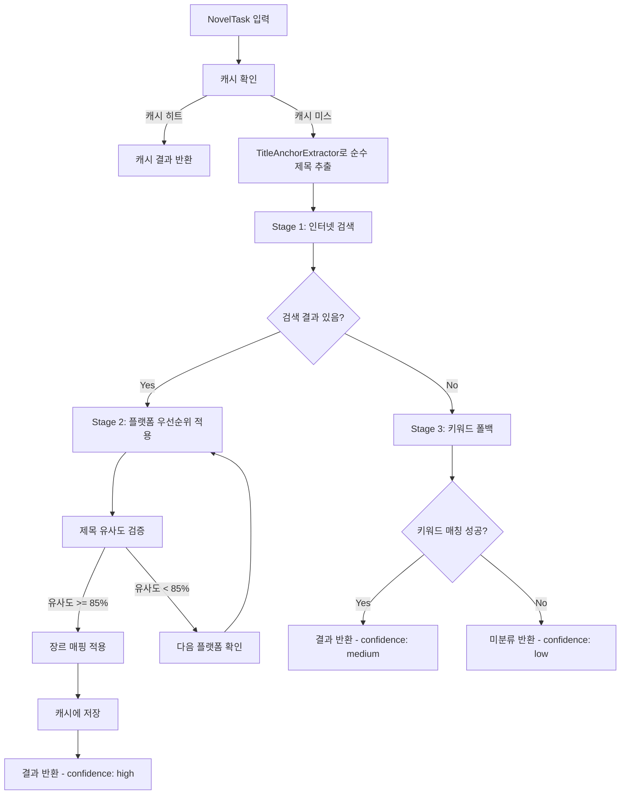

# Design Document: Search-First Genre Classifier

## Overview

이 설계 문서는 장르 분류 로직을 '검색 엔진 중심(Search-First Strategy)'으로 전면 개편하기 위한 기술적 설계를 정의합니다. 기존의 키워드 매칭 우선 방식에서 인터넷 검색 우선 방식으로 전환하여, 유명 작품들이 '미분류'로 처리되는 문제를 해결합니다.

### 핵심 설계 원칙

1. **Search-First**: 인터넷 검색을 최우선으로 수행하고, 키워드 매칭은 최후의 수단으로만 사용
2. **Cache-First**: 동일 제목에 대한 반복 검색을 방지하기 위해 캐시를 최우선으로 확인
3. **Platform Priority**: 신뢰도 높은 플랫폼의 정보를 우선 채택
4. **Title Similarity**: Levenshtein Distance로 제목 유사도를 검증하여 오분류 방지
5. **External Configuration**: 장르 매핑 규칙을 외부 JSON 파일로 관리하여 유지보수성 향상

## Architecture



## Components and Interfaces

### 1. SearchFirstClassifierAdapter (메인 클래스)

기존 `GenreClassifierAdapter`를 대체하는 새로운 어댑터입니다.

```python
class SearchFirstClassifierAdapter:
    """검색 엔진 중심의 장르 분류 어댑터"""
    
    def __init__(self, config: PipelineConfig, logger: Optional[PipelineLogger] = None):
        """
        Args:
            config: 파이프라인 설정
            logger: 파이프라인 로거
        """
        pass
    
    def classify(self, task: NovelTask) -> NovelTask:
        """
        장르 분류 후 task 업데이트
        
        분류 순서:
        1. 캐시 확인
        2. TitleAnchorExtractor로 순수 제목 추출
        3. Stage 1: 인터넷 검색
        4. Stage 2: 플랫폼 우선순위 적용 + 제목 유사도 검증
        5. Stage 3: 키워드 폴백 (검색 실패 시에만)
        
        Args:
            task: 분류할 NovelTask
            
        Returns:
            장르와 신뢰도가 업데이트된 NovelTask
        """
        pass
    
    def classify_batch(self, tasks: List[NovelTask]) -> List[NovelTask]:
        """여러 태스크 일괄 분류"""
        pass
    
    def close(self):
        """리소스 정리 및 캐시 저장"""
        pass
```

### 2. GenreCache (캐시 관리)

검색 결과를 캐싱하여 성능을 향상시킵니다.

```python
class GenreCache:
    """장르 검색 결과 캐시 관리"""
    
    CACHE_FILE = "config/genre_cache.json"
    
    def __init__(self):
        """캐시 파일 로드"""
        pass
    
    def get(self, title: str) -> Optional[Dict]:
        """
        캐시에서 장르 정보 조회
        
        Args:
            title: 순수 제목
            
        Returns:
            {'genre': str, 'confidence': str, 'source': str} 또는 None
        """
        pass
    
    def set(self, title: str, genre: str, confidence: str, source: str):
        """
        캐시에 장르 정보 저장
        
        Args:
            title: 순수 제목
            genre: 분류된 장르
            confidence: 신뢰도 (high, medium, low)
            source: 출처 (플랫폼명 또는 'keyword')
        """
        pass
    
    def save(self):
        """캐시를 파일에 저장"""
        pass
```

### 3. TitleSimilarityChecker (제목 유사도 검증)

Levenshtein Distance를 사용하여 제목 유사도를 검증합니다.

```python
class TitleSimilarityChecker:
    """제목 유사도 검증"""
    
    DEFAULT_THRESHOLD = 0.85  # 85%
    AUTHOR_MATCH_THRESHOLD = 0.75  # 저자명 일치 시 75%
    
    @staticmethod
    def calculate_similarity(title1: str, title2: str) -> float:
        """
        두 제목의 유사도 계산 (Levenshtein Distance 기반)
        
        Args:
            title1: 원본 제목
            title2: 비교 대상 제목
            
        Returns:
            0.0 ~ 1.0 사이의 유사도
        """
        pass
    
    @staticmethod
    def is_similar(title1: str, title2: str, author_match: bool = False) -> bool:
        """
        제목이 충분히 유사한지 확인
        
        Args:
            title1: 원본 제목
            title2: 비교 대상 제목
            author_match: 저자명 일치 여부
            
        Returns:
            유사도가 임계값 이상이면 True
        """
        pass
```

### 4. GenreMappingLoader (장르 매핑 로더)

외부 JSON 파일에서 장르 매핑 규칙을 로드합니다.

```python
class GenreMappingLoader:
    """장르 매핑 규칙 로더"""
    
    MAPPING_FILE = "config/genre_mapping.json"
    
    def __init__(self):
        """매핑 파일 로드 (실패 시 기본 매핑 사용)"""
        pass
    
    def map_genre(self, platform_genre: str) -> str:
        """
        플랫폼 장르를 표준 장르로 매핑
        
        Args:
            platform_genre: 플랫폼에서 추출한 장르명
            
        Returns:
            표준 장르명 (GENRE_WHITELIST에 있는 값)
        """
        pass
    
    def is_valid_genre(self, genre: str) -> bool:
        """장르가 GENRE_WHITELIST에 있는지 확인"""
        pass
```

## Data Models

### 1. config/genre_cache.json

```json
{
  "version": "1.0",
  "updated_at": "2025-12-28T00:00:00Z",
  "entries": {
    "100층의 올마스터": {
      "genre": "현판",
      "confidence": "high",
      "source": "리디북스",
      "cached_at": "2025-12-28T00:00:00Z"
    }
  }
}
```

### 2. config/genre_mapping.json

```json
{
  "version": "1.0",
  "mappings": {
    "로맨스 판타지": "로판",
    "로맨스판타지": "로판",
    "현대판타지": "현판",
    "현대 판타지": "현판",
    "현대물": "현판",
    "퓨전판타지": "퓨판",
    "퓨전 판타지": "퓨판",
    "퓨전물": "퓨판",
    "퓨전": "퓨판",
    "게임판타지": "겜판",
    "게임 판타지": "겜판",
    "게임": "겜판",
    "무협": "무협",
    "무협 소설": "무협",
    "선협": "선협",
    "판타지": "판타지",
    "정통판타지": "판타지",
    "정통 판타지": "판타지",
    "로맨스": "로판",
    "BL": "로판",
    "언정": "언정",
    "SF": "SF",
    "스포츠": "스포츠",
    "스포츠물": "스포츠",
    "역사": "역사",
    "역사물": "역사",
    "대체역사": "역사",
    "미스터리": "소설",
    "소설": "소설",
    "라이트노벨": "판타지"
  },
  "whitelist": ["현판", "퓨판", "무협", "로판", "겜판", "판타지", "SF", "역사", "선협", "언정", "스포츠", "소설", "미분류"]
}
```

### 3. 플랫폼 우선순위

```python
PLATFORM_PRIORITY = [
    ("리디북스", 1),
    ("문피아", 2),
    ("네이버시리즈", 3),
    ("카카오페이지", 4),
    ("소설넷", 5),
    ("노벨피아", 6),
    ("조아라", 7),
    ("웹툰가이드", 8),
    ("미스터블루", 9),
    ("교보문고", 10),
    ("YES24", 11),
    ("알라딘", 12),
]
```

## Correctness Properties

*A property is a characteristic or behavior that should hold true across all valid executions of a system-essentially, a formal statement about what the system should do. Properties serve as the bridge between human-readable specifications and machine-verifiable correctness guarantees.*

### Property 1: 노이즈 제거 후 순수 제목 추출

*For any* 파일명에 노이즈(화수 범위, 완결 마커, 저자명, 장르 태그)가 포함되어 있을 때, 검색 쿼리에는 해당 노이즈가 제거된 순수 제목만 포함되어야 한다.

**Validates: Requirements 1.2, 1.3, 1.4**

### Property 2: 플랫폼 우선순위에 따른 장르 선택

*For any* 여러 플랫폼에서 장르 정보가 발견되었을 때, 우선순위가 가장 높은 플랫폼의 장르가 선택되어야 한다.

**Validates: Requirements 4.1**

### Property 3: 장르 세분화 선택

*For any* 동일 플랫폼에서 여러 장르가 발견되었을 때, 더 세분화된 장르(예: 판타지보다 퓨판)가 선택되어야 한다.

**Validates: Requirements 4.3**

### Property 4: 플랫폼 장르 → 표준 장르 매핑

*For any* 플랫폼에서 추출된 장르명에 대해, genre_mapping.json의 규칙에 따라 표준 장르명으로 올바르게 매핑되어야 한다.

**Validates: Requirements 6.1, 6.2, 6.3, 6.4**

### Property 5: 화이트리스트 검증

*For any* 매핑된 장르가 GENRE_WHITELIST에 없으면, '미분류'로 설정되어야 한다.

**Validates: Requirements 6.5**

### Property 6: classify 메서드 필드 업데이트

*For any* NovelTask에 대해 classify 메서드 호출 후, task.genre, task.confidence, task.status 필드가 업데이트되어야 한다.

**Validates: Requirements 8.4**

### Property 7: 캐시 저장 및 조회

*For any* 검색 성공 후 캐시에 저장된 제목에 대해, 동일 제목으로 다시 분류 요청 시 캐시된 결과가 반환되어야 한다.

**Validates: Requirements 9.2, 9.4**

### Property 8: Levenshtein Distance 유사도 계산

*For any* 두 문자열에 대해, Levenshtein Distance 기반 유사도가 0.0 ~ 1.0 사이의 값으로 계산되어야 한다.

**Validates: Requirements 10.1**

### Property 9: 유사도 임계값에 따른 결과 채택/무시

*For any* 플랫폼 검색 결과에 대해, 제목 유사도가 85% 이상이면 채택되고, 85% 미만이면 무시되어야 한다. 단, 저자명이 일치하면 75%로 완화된다.

**Validates: Requirements 10.2, 10.3, 10.4**

## Error Handling

### 1. 네트워크 오류

- 검색 API 호출 실패 시 웹 크롤링으로 폴백
- 웹 크롤링도 실패 시 키워드 매칭으로 폴백
- 모든 네트워크 요청에 10초 타임아웃 적용

### 2. 캐시 파일 오류

- 캐시 파일이 없거나 손상된 경우 빈 캐시로 시작
- 캐시 저장 실패 시 로그만 남기고 계속 진행

### 3. 매핑 파일 오류

- 매핑 파일이 없거나 손상된 경우 내장된 기본 매핑 사용
- 매핑 파일 로드 실패 시 경고 로그 출력

### 4. 플랫폼 추출 오류

- 개별 플랫폼 추출 실패 시 다음 플랫폼으로 진행
- 모든 플랫폼 실패 시 키워드 매칭으로 폴백

## Testing Strategy

### Unit Tests

1. **TitleSimilarityChecker 테스트**
   - Levenshtein Distance 계산 정확성
   - 유사도 임계값 적용 정확성
   - 저자명 일치 시 임계값 완화

2. **GenreMappingLoader 테스트**
   - 매핑 파일 로드 성공/실패
   - 플랫폼 장르 → 표준 장르 매핑
   - 화이트리스트 검증

3. **GenreCache 테스트**
   - 캐시 저장/조회
   - 캐시 파일 저장/로드
   - 캐시 미스 처리

### Property-Based Tests

Property-based testing library: **Hypothesis** (Python)

각 테스트는 최소 100회 반복 실행됩니다.

1. **Property 1 테스트**: 노이즈가 포함된 임의의 파일명 생성 → 순수 제목 추출 검증
2. **Property 4 테스트**: 임의의 플랫폼 장르명 생성 → 매핑 결과 검증
3. **Property 8 테스트**: 임의의 두 문자열 생성 → 유사도 범위 검증
4. **Property 9 테스트**: 임의의 제목 쌍과 유사도 생성 → 채택/무시 결과 검증

### Integration Tests

1. **실제 제목 분류 테스트**
   - '100층의 올마스터' → 미분류가 아닌 결과
   - '1588 샤인머스캣으로 귀농 왔더니 신대륙' → 미분류가 아닌 결과

2. **3단계 분류 전략 테스트**
   - 검색 성공 시 confidence='high'
   - 키워드 폴백 시 confidence='medium'
   - 모든 실패 시 confidence='low', genre='미분류'
