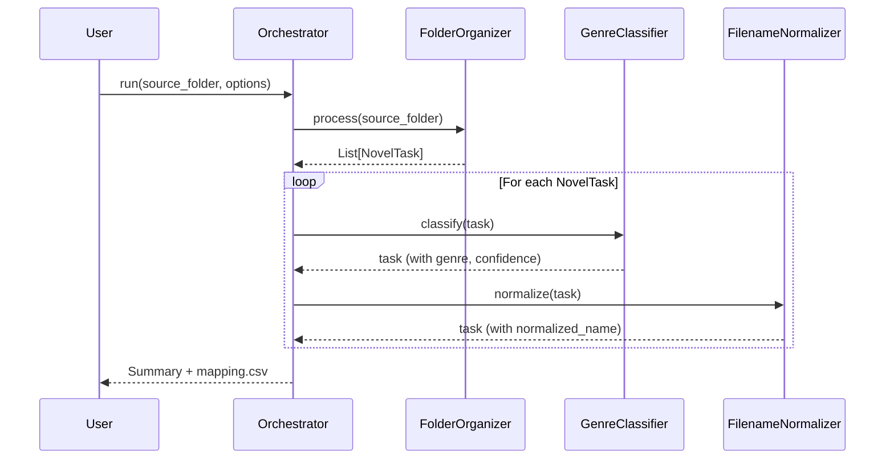

# Design Document: Web Novel Archive Pipeline (WNAP)

## Overview

WNAP는 웹소설 아카이브 파일을 자동으로 정리하는 3단계 파이프라인입니다. 기존 독립 모듈들(FolderOrganizer, GenreClassifier, FilenameNormalizer)을 NovelTask 데이터 객체를 중심으로 통합하여, 압축 해제부터 파일명 정규화까지 한 번에 처리합니다.

### 핵심 설계 원칙
1. **NovelTask 중심 데이터 흐름**: 모든 모듈이 동일한 데이터 구조를 공유
2. **제목 앵커 전략**: 파일명에서 핵심 제목을 먼저 추출하고, 잔여 문자열에서 메타데이터 파싱
3. **Fault-Tolerance**: 개별 파일 에러가 전체 파이프라인을 중단시키지 않음
4. **Dry-Run 지원**: 실제 변경 전 미리보기 가능

## Architecture

```mermaid
flowchart TB
    subgraph Input
        SF[Source Folder]
        CF[Config File]
    end
    
    subgraph Pipeline["Pipeline Orchestrator"]
        direction TB
        S1[Stage 1: Folder Organizer]
        S2[Stage 2: Genre Classifier]
        S3[Stage 3: Filename Normalizer]
        
        S1 -->|NovelTask[]| S2
        S2 -->|NovelTask[]| S3
    end
    
    subgraph Output
        TF[Target Folder]
        CSV[mapping.csv]
        LOG[pipeline.log]
    end
    
    SF --> S1
    CF --> Pipeline
    S3 --> TF
    Pipeline --> CSV
    Pipeline --> LOG
```

### 데이터 흐름



## Components and Interfaces

### 1. NovelTask (Data Model)

```python
@dataclass
class NovelTask:
    """웹소설 처리의 모든 상태를 담는 데이터 객체"""
    # 파일 경로
    original_path: Path          # 원본 파일 경로
    current_path: Path           # 현재 파일 경로 (처리 중 변경될 수 있음)
    
    # 파싱된 정보
    raw_name: str                # 원본 파일명 (확장자 제외)
    title: str = ""              # 추출된 제목 (Title Anchor)
    author: str = ""             # 저자명
    genre: str = ""              # 분류된 장르
    volume_info: str = ""        # 권/부 정보 (예: "1-2부")
    range_info: str = ""         # 범위 정보 (예: "1-536")
    is_completed: bool = False   # 완결 여부
    side_story: str = ""         # 외전 정보
    
    # 처리 상태
    status: str = "pending"      # pending, processing, completed, failed, skipped
    confidence: str = "none"     # none, low, medium, high
    error_message: str = ""      # 에러 발생 시 메시지
    
    # 메타데이터
    metadata: Dict = field(default_factory=dict)
    
    def to_dict(self) -> Dict:
        """JSON 직렬화를 위한 딕셔너리 변환"""
        return {
            'original_path': str(self.original_path),
            'current_path': str(self.current_path),
            'raw_name': self.raw_name,
            'title': self.title,
            'author': self.author,
            'genre': self.genre,
            'volume_info': self.volume_info,
            'range_info': self.range_info,
            'is_completed': self.is_completed,
            'side_story': self.side_story,
            'status': self.status,
            'confidence': self.confidence,
            'error_message': self.error_message,
            'metadata': self.metadata
        }
    
    @classmethod
    def from_dict(cls, data: Dict) -> 'NovelTask':
        """딕셔너리에서 NovelTask 복원"""
        return cls(
            original_path=Path(data['original_path']),
            current_path=Path(data['current_path']),
            raw_name=data['raw_name'],
            title=data.get('title', ''),
            author=data.get('author', ''),
            genre=data.get('genre', ''),
            volume_info=data.get('volume_info', ''),
            range_info=data.get('range_info', ''),
            is_completed=data.get('is_completed', False),
            side_story=data.get('side_story', ''),
            status=data.get('status', 'pending'),
            confidence=data.get('confidence', 'none'),
            error_message=data.get('error_message', ''),
            metadata=data.get('metadata', {})
        )
```

### 2. Pipeline Orchestrator

```python
class PipelineOrchestrator:
    """파이프라인 전체를 조율하는 메인 컨트롤러"""
    
    def __init__(self, config: PipelineConfig):
        self.config = config
        self.folder_organizer = FolderOrganizer(config)
        self.genre_classifier = GenreClassifier(config)
        self.filename_normalizer = FilenameNormalizer(config)
        self.logger = PipelineLogger(config.log_level)
    
    def run(self, source_folder: Path, dry_run: bool = False) -> PipelineResult:
        """파이프라인 실행"""
        pass
    
    def _process_task(self, task: NovelTask, dry_run: bool) -> NovelTask:
        """단일 태스크 처리 (with retry)"""
        pass
```

### 3. Folder Organizer (Stage 1)

```python
class FolderOrganizerAdapter:
    """기존 FolderOrganizer를 파이프라인에 맞게 래핑"""
    
    def process(self, source_folder: Path) -> List[NovelTask]:
        """폴더 정리 후 NovelTask 목록 반환"""
        pass
    
    def _create_task_from_file(self, file_path: Path) -> NovelTask:
        """파일에서 NovelTask 생성"""
        pass
```

### 4. Genre Classifier (Stage 2)

```python
class GenreClassifierAdapter:
    """기존 GenreClassifier를 파이프라인에 맞게 래핑"""
    
    def classify(self, task: NovelTask) -> NovelTask:
        """장르 분류 후 task 업데이트"""
        pass
    
    def _calculate_confidence(self, scores: List[Tuple[str, float]]) -> str:
        """점수 기반 신뢰도 계산"""
        pass
```

### 5. Title Anchor Extractor

```python
class TitleAnchorExtractor:
    """제목 앵커 추출 및 잔여 문자열 파싱"""
    
    def extract(self, raw_name: str) -> TitleParseResult:
        """
        처리 순서:
        1. 노이즈 제거 (저자명, 번역 정보 등)
        2. 제목 앵커 추출
        3. 잔여 문자열에서 메타데이터 파싱
        """
        pass
    
    def _extract_title_anchor(self, cleaned: str) -> Tuple[str, str]:
        """제목 앵커와 잔여 문자열 분리"""
        pass
    
    def _parse_residual(self, residual: str) -> ResidualParseResult:
        """잔여 문자열에서 권수/범위/완결/외전 파싱"""
        pass

@dataclass
class TitleParseResult:
    title: str
    author: str
    volume_info: str
    range_info: str
    is_completed: bool
    side_story: str
```

### 6. Filename Normalizer (Stage 3)

```python
class FilenameNormalizerAdapter:
    """기존 정규화 로직을 파이프라인에 맞게 래핑"""
    
    def normalize(self, task: NovelTask) -> NovelTask:
        """파일명 정규화 후 task 업데이트"""
        pass
    
    def _build_normalized_name(self, task: NovelTask) -> str:
        """표준 형식 파일명 생성: [장르] 제목 부정보 범위 (완) + 외전.확장자"""
        pass
    
    def _handle_collision(self, target_path: Path) -> Path:
        """파일명 충돌 시 숫자 접미사 추가"""
        pass
```

## Data Models

### PipelineConfig

```python
@dataclass
class PipelineConfig:
    source_folder: Path
    target_folder: Path
    protected_folders: List[str] = field(default_factory=lambda: ["Downloads", "Tempfile", "정리완료"])
    genre_whitelist: Set[str] = field(default_factory=lambda: GENRE_WHITELIST)
    log_level: str = "INFO"
    max_retries: int = 1
    dry_run: bool = False
```

### PipelineResult

```python
@dataclass
class PipelineResult:
    total_files: int
    processed: int
    failed: int
    skipped: int
    tasks: List[NovelTask]
    mapping_csv_path: Path
    errors: List[str]
```

### Genre Mapping Tables

```python
# 플랫폼별 장르 → 표준 장르 매핑
PLATFORM_GENRE_MAPPING = {
    # 네이버 시리즈
    '현대판타지': '현판',
    '퓨전판타지': '퓨판',
    '게임판타지': '겜판',
    '로맨스판타지': '로판',
    
    # 카카오페이지
    '현대 판타지': '현판',
    '퓨전 판타지': '퓨판',
    
    # 문피아
    '현대물': '현판',
    '퓨전물': '퓨판',
    
    # 공통
    '퓨전': '퓨판',
    '게임': '겜판',
    '로맨스': '로판',
    'BL': '로판',
}

# 표준 장르 화이트리스트
GENRE_WHITELIST = {
    '소설', '판타지', '현대', '현판', '무협', '선협', 
    '스포츠', '퓨판', '역사', '로판', 'SF', '겜판', 
    '언정', '공포', '패러디', '미분류'
}
```

## Correctness Properties

*A property is a characteristic or behavior that should hold true across all valid executions of a system—essentially, a formal statement about what the system should do. Properties serve as the bridge between human-readable specifications and machine-verifiable correctness guarantees.*

### Property 1: NovelTask Serialization Round-Trip

*For any* valid NovelTask object, serializing to JSON then deserializing SHALL produce an equivalent object with all fields preserved.

**Validates: Requirements 1.4, 1.5**

### Property 2: Protected Folders Exclusion

*For any* source folder scan, the result SHALL never include files from protected folders (Downloads, Tempfile, 정리완료).

**Validates: Requirements 2.1**

### Property 3: Single Text File Extraction

*For any* archive containing exactly one .txt file, extraction SHALL produce exactly one file matching that .txt file.

**Validates: Requirements 2.3**

### Property 4: NovelTask Creation Count

*For any* folder processing operation, the number of created NovelTask objects SHALL equal the number of extracted/processed files.

**Validates: Requirements 2.5**

### Property 5: Genre Classification Determinism

*For any* input text, the Genre_Classifier SHALL always return the same genre and confidence when given the same input and keyword configuration.

**Validates: Requirements 3.3, 3.4**

### Property 6: Confidence Threshold Consistency

*For any* classification result, if confidence score is >90% then confidence level SHALL be "high", if 50-90% then "medium", if <50% then "low".

**Validates: Requirements 3.5, 3.6, 3.7**

### Property 7: Compound Pattern Priority

*For any* input matching both compound patterns and single keywords, the compound pattern score SHALL be applied before single keyword scores.

**Validates: Requirements 3.8**

### Property 8: Default Genre Fallback

*For any* input with no keyword matches and no platform results, the assigned genre SHALL be "미분류" with confidence "low".

**Validates: Requirements 3.10**

### Property 9: Title Anchor Residual Separation

*For any* filename parsing, volume/range/completion information SHALL only be extracted from the residual string (after title anchor extraction), never from the title anchor itself.

**Validates: Requirements 4.3, 4.4, 4.9**

### Property 10: Filename Normalization Round-Trip

*For any* valid filename, parsing then formatting SHALL preserve all semantic information (title, genre, volume, range, completion status, side story).

**Validates: Requirements 4.8, 5.7**

### Property 11: Normalized Filename Format

*For any* normalized filename, it SHALL match the pattern: `[장르] 제목 부정보 범위 (완) + 외전.확장자` where optional parts may be omitted.

**Validates: Requirements 5.1**

### Property 12: Genre Whitelist Enforcement

*For any* normalized filename, the genre in brackets SHALL be a member of GENRE_WHITELIST.

**Validates: Requirements 5.2**

### Property 13: Pipeline Stage Order

*For any* pipeline execution, stages SHALL execute in order: FolderOrganizer → GenreClassifier → FilenameNormalizer.

**Validates: Requirements 6.1**

### Property 14: Fault Isolation

*For any* pipeline execution where a single file causes an error, only that file SHALL be marked as failed/skipped, and all other files SHALL continue processing.

**Validates: Requirements 6.6, 6.7**

### Property 15: Dry-Run Immutability

*For any* pipeline execution in dry-run mode, no files SHALL be created, modified, or deleted on the filesystem.

**Validates: Requirements 6.3**

### Property 16: Configuration Round-Trip

*For any* valid PipelineConfig object, serializing to JSON then deserializing SHALL produce an equivalent configuration.

**Validates: Requirements 10.5**

## Error Handling

### Error Categories

| Category | Example | Handling |
|----------|---------|----------|
| Archive Error | Corrupted ZIP file | Log error, skip file, continue pipeline |
| Classification Error | No keywords match | Assign "미분류" with "low" confidence |
| Normalization Error | Invalid characters | Sanitize filename, log warning |
| File System Error | Permission denied | Retry once, then skip with error log |
| Configuration Error | Invalid JSON | Fail fast with clear error message |

### Retry Strategy

```python
def process_with_retry(task: NovelTask, max_retries: int = 1) -> NovelTask:
    for attempt in range(max_retries + 1):
        try:
            return process_task(task)
        except TransientError as e:
            if attempt < max_retries:
                logger.warning(f"Retry {attempt + 1}/{max_retries} for {task.raw_name}")
                continue
            task.status = "failed"
            task.error_message = str(e)
    return task
```

## Testing Strategy

### Unit Tests
- NovelTask serialization/deserialization
- Individual component methods (TitleAnchorExtractor, GenreClassifier, etc.)
- Edge cases: empty filenames, special characters, very long names

### Property-Based Tests
- Round-trip properties (serialization, filename normalization)
- Invariant properties (genre whitelist, confidence thresholds)
- Fault isolation properties

### Integration Tests
- Full pipeline execution with sample data
- Dry-run mode verification
- Error recovery scenarios

### Test Configuration
- Property tests: minimum 100 iterations per property
- Test framework: pytest with hypothesis for property-based testing
- Tag format: **Feature: wnap-pipeline, Property {number}: {property_text}**
