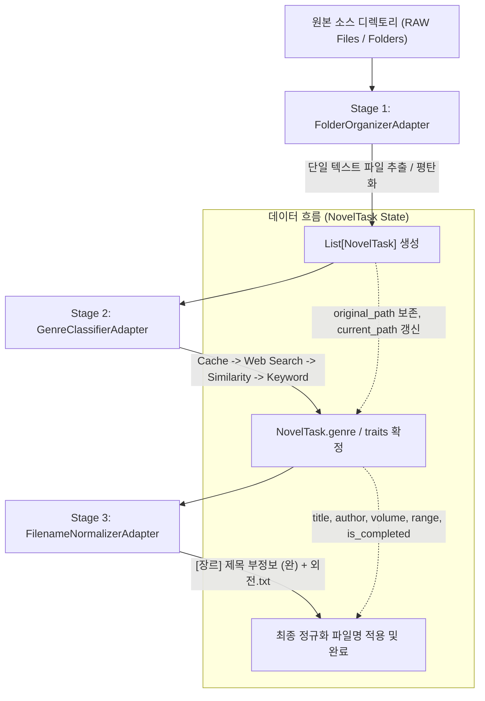

# WNAP (Web Novel Archive Pipeline) 마스터 참조 가이드

> **문서 버전:** v1.3.33  
> **최종 갱신일:** 2026-09-07  
> **목적:** WNAP 시스템의 전체 아키텍처, 디렉토리/파일별 역할, 상호 의존 관계, 코딩 불변 규칙(Invariants), 디버깅 절차를 집대성한 공식 참조 매뉴얼.  
> ⚠️ **필독 사항:** WNAP 프로젝트의 코드를 수정하거나 디버깅하기 전, **반드시 이 문서를 먼저 정독**하고 명시된 규칙을 준수해야 합니다.

---

## 1. 시스템 개요 및 아키텍처

WNAP(Web Novel Archive Pipeline)은 웹소설 텍스트 및 압축 파일을 자동으로 스캔하여, **[압축 해제/폴더 정리] → [인터넷 검색 기반 장르 분류] → [표준 명명 규칙 파일명 정규화]**를 일괄 처리하는 통합 아카이빙 파이프라인 시스템입니다.

### 1.1 3단계 파이프라인 구조



---

## 2. 디렉토리 및 파일 역할 맵 (Directory & File Map)

```
WebNovelManager/
├── main.py                     # [Entrypoint] 애플리케이션 최상위 진입점 (GUI 및 CLI 지원)
├── build_exe.py                # [Build] PyInstaller 단일 실행 파일(.exe) 패키징 스크립트
├── conftest.py                 # [Test Config] pytest 루트 경로 등록 및 전역 설정
├── pytest.ini                  # [Test Config] pytest 테스트 경로 및 No_use 제외 설정
├── pyrightconfig.json          # [Linter] Pyrefly/Pyright 정적 분석기 루트 경로 설정
├── requirements.txt            # [Dependencies] 프로젝트 필수 파이썬 패키지 목록
├── list.txt                    # [Dataset] 소설 제목 검증 및 벤치마크용 텍스트 리스트
├── 7z.exe, UnRAR.exe           # [Binaries] 압축 파일 해제를 위한 필수 외부 바이너리
│
├── config/                     # [Configuration] 전역 설정 및 정적 매핑 데이터
│   ├── pipeline_config.py      # 파이프라인 설정 데이터클래스 (PipelineConfig, GENRE_WHITELIST)
│   ├── pipeline_config.json    # 사용자 수정 가능한 기본 설정 JSON
│   ├── genre_mapping.json      # 플랫폼 장르명을 표준 장르명으로 변환하는 규칙
│   ├── genre_cache.json        # 인터넷 검색 장르 결과 로컬 영구 캐시
│   └── gui_state.json          # GUI 창 위치 및 크기 상태
│
├── core/                       # [Core Engine] 신규 표준 파이프라인 아키텍처
│   ├── novel_task.py           # 파이프라인 전 단계를 관통하는 핵심 데이터 모델 (NovelTask)
│   ├── pipeline_orchestrator.py# 파이프라인 전체 조율 컨트롤러 (PipelineOrchestrator)
│   ├── pipeline_logger.py      # UTF-8 및 10MB 자동 로테이션 통합 로거 (PipelineLogger)
│   ├── path_utils.py           # PyInstaller frozen 환경과 스크립트 환경 간 경로 변환 유틸
│   ├── version.py              # 단일 진실 공급원 버전 관리 (__version__, RELEASE_DATE)
│   ├── title_anchor_extractor.py # 핵심 제목(Title Anchor) 선추출 및 잔여 메타데이터 정밀 파서
│   ├── adapters/               # 단계별 실행 엔진을 래핑하는 어댑터 레이어
│   │   ├── folder_organizer_adapter.py     # Stage 1: 폴더 정리/압축 해제 어댑터
│   │   ├── genre_classifier_adapter.py     # Stage 2: Search-First 장르 분류 어댑터
│   │   └── filename_normalizer_adapter.py  # Stage 3: 파일명 표준화 어댑터
│   └── utils/                  # 코어 보조 유틸리티
│       ├── novel_trait_extractor.py        # 서브 특징 키워드(사합원, 연대물 등) 추출 및 다중 태그 조합
│       ├── genre_mapping.py                # 장르 매핑 JSON 로더
│       ├── genre_cache.py                  # 장르 캐시 I/O 매니저
│       └── similarity.py                   # 레벤슈타인 거리 기반 제목 유사도 검증기
│
├── gui/                        # [GUI Layer] CustomTkinter 기반 통합 데스크톱 UI
│   ├── main_window.py          # 메인 윈도우 UI (설정, 실행, 테이블, 진행률 표시)
│   ├── genre_confirm_dialog.py # 장르 신뢰도 medium 항목에 대한 사용자 수동 확인 다이얼로그
│   └── utils/
│       ├── state_manager.py    # 윈도우 상태 저장 및 오프스크린 보정 관리자
│       └── tooltip_manager.py  # 비차단(Non-blocking) 도움말 툴팁 매니저
│
├── modules/                    # [Engines] 어댑터가 의존하는 하위 실행 모듈
│   ├── organizer/
│   │   └── folder_organizer.py # 압축 해제, 파일 평탄화, 안전 복사 실제 구현체
│   └── classifier/
│       ├── api_config_manager.py # 네이버/구글 API 키 암호화 및 .env 하이브리드 로더
│       ├── genre_keywords.json   # 로컬 키워드 매칭 사전
│       ├── selectors.json        # 웹 스크래핑 HTML 셀렉터 정의
│       ├── .api_key              # 로컬 암호화 키 파일
│       └── src/                  # 크롤러, 플랫폼 추출기, 하이브리드 분류기 소스
│
├── scripts/                    # [Scripts] 검증 및 배치 운영 도구
│   ├── run_new_100_verification.py # list.txt 기반 100개 무작위 샘플 파이프라인 자동 검증기
│   ├── batch_classify.py           # 대량 텍스트 목록 일괄 장르 분류 CLI 도구
│   └── batch_retry_failed.py       # 미분류 항목 대상 구글 검색 재시도 스크립트
│
├── tests/                      # [Tests] pytest 자동화 단위 및 통합 테스트 스위트
│   ├── test_complex_files_integrity.py  # 복잡 파일명 정규화 무결성 테스트
│   ├── test_folder_organizer_mock.py    # 폴더 정리 및 압축 해제 Mock 테스트 (21개 케이스)
│   ├── test_foreign_title_parser.py     # 외국어/한자 병기 제목 추출 테스트
│   ├── test_genre_search.py             # 장르 검색 및 캐시 테스트
│   ├── test_google_real_execution.py    # 구글 검색 엔진 연동 테스트
│   ├── test_hybrid_security.py          # API 키 보안 및 암호화 테스트
│   ├── test_logger.py                   # UTF-8 로거 기능 테스트
│   ├── test_novel_trait_extractor.py    # 소설 특성 키워드 다중 추출 테스트
│   └── test_novelnet_filter.py          # 소설넷 URL 화이트리스트 필터링 테스트
│
└── No_use/                     # [Archive] 과거 레거시 도구, 임시 파일, 이전 버전 산출물 격리 보관소
    ├── _cleanup_temp/          # 과거 임시 백업 및 인코딩 깨진 구버전 파일들
    ├── legacy_modules/         # 과거 독립 GUI 시절의 도구들 (renameFiles, standalone GUIs)
    ├── verification_results/   # 과거 실행된 1회성 매핑 및 샘플 검증 JSON/CSV 파일들
    ├── build_artifacts/        # 구버전 spec 파일 및 build 캐시
    ├── old_logs/               # 과거 날짜별 실행 로그 파일들
    └── test_temp/              # 개발 도중 1회성으로 사용된 분석/구문 검증 스크립트들
```

---

## 3. 핵심 데이터 모델: `NovelTask` 수명 주기

`NovelTask`(`core/novel_task.py`)는 파이프라인의 모든 단계에서 상태를 추적하는 유일한 표준 데이터 객체입니다.

### 3.1 주요 필드 정의
| 필드명 | 타입 | 설명 |
| :--- | :--- | :--- |
| `original_path` | `Path` | 사용자가 지정한 원본 파일의 최초 경로 (**절대 변경 금지**) |
| `current_path` | `Path` | 압축 해제, 파일 이동, 이름 변경 등 단계별 처리 후의 현재 실제 파일 경로 |
| `raw_name` | `str` | 확장자를 제외한 파일의 원본 이름 문자열 |
| `title` | `str` | `TitleAnchorExtractor`에 의해 추출된 순수 핵심 제목 (노이즈 제거 완료) |
| `author` | `str` | 추출된 저자명 (없을 경우 빈 문자열) |
| `genre` | `str` | 분류 확정된 표준 장르명 (예: `현판`, `무협`, `[언정, 궁투, 사합원]`) |
| `volume_info` | `str` | 권/부 정보 (예: `1-2부`, `1권`) |
| `range_info` | `str` | 화/장 범위 정보 (예: `1-536`, `001-100화`) |
| `is_completed` | `bool` | 완결 여부 (`완`, `完`, `완결` 감지 시 True) |
| `side_story` | `str` | 외전 정보 (예: `외전`, `외전 1-5`, `특별외전`) |
| `status` | `str` | `pending` → `processing` → `completed` / `failed` / `skipped` |
| `confidence` | `str` | 장르 분류 신뢰도 (`high`, `medium`, `low`, `none`) |
| `source` | `str` | 장르 결정 출처 (`cache`, `naver_series`, `kakao`, `keyword`, `user` 등) |

### 3.2 단계별 상태 전이 불변 규칙
1. **Stage 1 완료 후:** `current_path`는 정리완료 디렉토리의 추출된 텍스트 파일 경로로 갱신됩니다.
2. **Stage 2 진입 전:** `title`이 비어있는 경우 `TitleAnchorExtractor.extract(raw_name)`를 통해 선제 추출합니다.
3. **Stage 2 완료 후:** `task.genre`, `task.confidence`, `task.source`가 결정됩니다. `confidence == 'medium'`인 경우 사용자 확인 대화상자로 분기합니다.
4. **Stage 3 완료 후:** `current_path`가 최종 정규화 파일명으로 변경되며, `status = 'completed'`가 됩니다.

---

## 4. 코딩 및 개발 절대 불변 규칙 (Crucial Coding Rules)

### 규칙 1: Annotation-First & Search-First 장르 분류 계층 순서 엄수
장르 분류 시 반드시 아래 순서를 엄격히 준수해야 합니다:
1. **파일명 첨언 우선 추출 (Annotation-First):** 파일명 앞 접두사 태그(`[장르]`, `[특성]`) 또는 뒤 첨언(`(AI번역)`, `#해시태그`)에 명시된 장르/특성이 있는 경우 웹 검색보다 최우선으로 확정합니다. (예: `... #패러디 #해리포터.txt` → `[패러디, 해리포터]`, `[언정][AI번역][연대]` → `[언정, 연대물]`)
2. **Cache 확인 (Cache-First):** `GenreCache`에 이미 승인된 장르가 있는지 먼저 조회합니다.
3. **웹 검색 (Search-First):** 네이버 검색 API(NaverGenreExtractorV4) → 실패 시 구글 CSE 검색(GoogleGenreExtractor).
4. **플랫폼 가중치 및 제목 유사도 검증:** 검색 결과의 제목과 원본 `task.title`의 유사도(`TitleSimilarityChecker`)가 85% 이상(저자 일치 시 75% 이상)일 때만 채택합니다.
5. **로컬 키워드 폴백 (Keyword Fallback):** 웹 검색에서 유효한 장르를 얻지 못한 경우에만 로컬 키워드 사전(`genre_keywords.json`)으로 분류합니다.

### 규칙 2: Title Anchor 선추출 및 복합 완결/외전(完外) 처리 원칙
* 제목 중간에 숫자가 포함된 작품(예: `100층의 올마스터`, `1번가 기적`, `7번째 기사`)이 권수/범위 정규식에 의해 훼손되지 않도록, **반드시 핵심 제목을 먼저 추출(Anchor)한 후 나머지 잔여 문자열에서만 권수/범위를 파싱**해야 합니다.
* `完外`, `完+外`, `완+외전` 등 완결과 외전이 동시에 표기된 복합 마커는 `is_completed=True` 및 `side_story="외전"`을 동시에 파싱하여 `제목 (완) + 외전.확장자` 형태로 정규화해야 합니다. (원문 외국어 제목으로 오인식되어 소실되지 않도록 마커 문자 검증 적용)

### 규칙 3: 파일 시스템 안전 복사(Safe Copy) 원칙
* 원본 파일 손실을 방지하기 위해 파일 이동(`move`) 대신 **안전 복사(`shutil.copy2`) 및 격리(Temp 보존)** 방식을 우선합니다.
* 사용자의 `Downloads`, `Temp` 및 지정된 보호 폴더(`protected_folders`)는 절대 삭제하거나 침범하지 않습니다.

### 규칙 4: Windows 한글 인코딩 및 파일명 제약 처리
* 콘솔 출력 및 파일 I/O는 기본적으로 `utf-8`을 사용하되, 기존 압축 파일 메타데이터 디코딩 시 한글 깨짐이 감지되면 `cp949` 폴백을 적용합니다.
* 파일명 조립 시 Windows 파일 시스템 금지 문자(`< > : " / \ | ? *`)는 공백 또는 안전 문자로 자동 치환되어야 합니다.

### 규칙 5: 결함 격리 (Fault Isolation)
* 1000개의 파일 중 1개의 파일에서 파싱 또는 I/O 오류가 발생하더라도, **해당 태스크만 `failed` 처리하고 로그를 남긴 후 다음 파일 처리를 계속 진행**해야 합니다. 파이프라인 전체가 크래시되어서는 안 됩니다.

### 규칙 6: No_use 폴더 보호
* `No_use/` 폴더는 과거 버전 및 분석 산출물을 보존하기 위한 아카이브입니다. **활성 코드(`core/`, `gui/`, `main.py` 등)에서 `No_use/` 내부의 모듈이나 파일을 import하거나 참조해서는 절대 안 됩니다.**

---

## 5. 디버깅 및 문제 해결 가이드 (Debugging & FAQ)

### Q1. IDE/린터에서 `Cannot find module 'core....' Pyrefly(missing-import)` 경고가 뜰 때
* **원인:** 실행 스크립트가 프로젝트 루트 외부에 있거나, 언어 서버(Pyrefly/Pyright)의 `extraPaths`에 프로젝트 루트가 등록되지 않았기 때문입니다.
* **해결법:**
  1. 프로젝트 루트의 `pyrightconfig.json`과 `.vscode/settings.json`에 `.` 및 `${workspaceFolder}`가 등록되어 있는지 확인합니다.
  2. 외부 스크립트인 경우 임포트 문 뒤에 `# type: ignore`를 붙여 정적 분석기 오탐지를 방지합니다.

### Q2. 테스트 실행 시 `UnicodeDecodeError`가 발생할 때
* **원인:** 과거 임시 폴더(`_cleanup_temp` 등)에 인코딩이 손상된 텍스트 파일이 포함되어 있어 pytest가 수집하려 할 때 발생합니다.
* **해결법:**
  1. 프로젝트 루트의 `pytest.ini`에 `norecursedirs = No_use build dist _cleanup_temp`가 설정되어 있는지 확인합니다.
  2. `pytest` 명령어를 단독 실행하여 116개 테스트가 모두 통과하는지 검증합니다.

### Q3. 장르가 '미분류'로 떨어지거나 엉뚱한 장르로 분류될 때
* **원인:**
  1. `TitleAnchorExtractor`가 제목 외의 불필요한 태그를 제목으로 잘못 인식한 경우.
  2. 네이버/구글 검색 결과 제목과 원본 제목 간 유사도가 85% 미만이어서 기각된 경우.
  3. API 쿼터 초과(429/403)로 인해 검색이 차단된 경우.
* **해결법:**
  1. `scripts/run_new_100_verification.py`를 실행하여 해당 제목의 파싱 결과(`parsed.title`)를 확인합니다.
  2. `config/genre_cache.json`에 해당 제목이 잘못된 장르로 캐시되어 있는지 점검합니다.
  3. `.env` 파일의 `NAVER_CLIENT_ID` / `NAVER_CLIENT_SECRET` 또는 구글 API 키의 정상 작동 여부를 확인합니다.

---

## 6. 테스트 및 빌드 검증 절차

코드를 수정한 후에는 반드시 아래 3단계를 거쳐 무결성을 검증해야 합니다:

```bash
# 1. 전체 단위/통합 테스트 실행 (116개 테스트 전원 통과 필수)
pytest

# 2. 모든 활성 파이썬 파일 문법 검증
python -m py_compile main.py build_exe.py config/pipeline_config.py core/**/*.py gui/**/*.py

# 3. 애플리케이션 진입점 정상 구동 확인
python main.py --help
```
